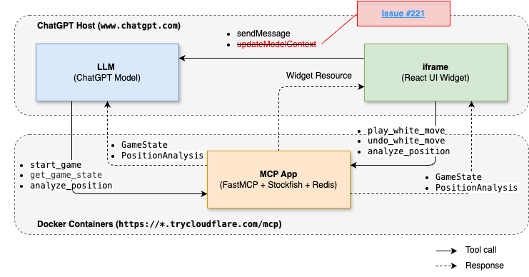
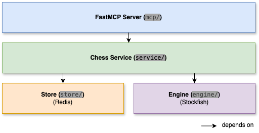

[](https://github.com/mdeclerk/StockfishGPT/actions/workflows/CI.yml)

# StockfishGPT

[](https://developers.openai.com/apps-sdk)
[](https://stockfishchess.org)
[](https://gofastmcp.com)
[](https://react.dev)
[](https://vitejs.dev)
[](https://redis.io)
[](https://nginx.org)
[](https://www.docker.com)

StockfishGPT is an [OpenAI Apps SDK](https://developers.openai.com/apps-sdk)-based App for playing White against Stockfish in ChatGPT, with an interactive React board and engine-grounded coaching.

<p align="left">
  
</p>

## Quickstart

1. **Deploy locally, described [here](#local-deployment)**

2. **Connect to ChatGPT, described [here](https://developers.openai.com/plugins/deploy/connect-chatgpt)**

   > ⚠️ Make sure **Developer Mode** is activated (Settings → Security and login → Developer mode).
   - Name: `StockfishGPT`
   - URL: public tunnel URL from step 1 — don't forget to append `/mcp`!
   - No Auth

3. **Play in [ChatGPT](https://www.chatgpt.com)**

   ```sh
   @StockfishGPT play
   ```

## Deployment

### Local deployment

Install [Docker](https://docs.docker.com/get-docker/), start containers:

```sh
docker compose up
```

Find the public tunnel URL `https://*.trycloudflare.com` in the console output, or retrieve it explicitly before connecting with ChatGPT:

```sh
docker compose logs tunnel | grep trycloudflare
```

Docker Compose topology: ChatGPT ─► cloudflared ─► nginx ─► mcp-app ─► Redis

### Cloud deployment

CI builds the multi-architecture Docker image [stockfishgpt:latest](https://github.com/mdeclerk/StockfishGPT/pkgs/container/stockfishgpt) on every push to `main`. Container configuration:

| Environment | When needed | Default |
| --- | --- | --- |
| `PORT` | When the platform requires a different port | `8000` |
| `REDIS_URL` | Required for multiple replicas | Unset ─► In-process store fallback |

Intended cloud topology: ChatGPT ─► HTTPS Ingress / Load Balancer ─► StockfishGPT (× N Replicas) ─► Redis

## Architecture

### MCP integration

The MCP app owns each game and returns complete authoritative snapshots. The widget is a display client: it submits actions, renders the returned FEN and history, and keeps only ephemeral presentation state. MCP HTTP transport stays stateless (`stateless_http=True`).

> ⚠️ `ui/update-model-context` cannot currently be applied reliably due to [known upstream issue #221](https://github.com/openai/openai-apps-sdk-examples/issues/221).

<p align="left">
  
</p>

| MCP Tool | Arguments | Response | Visibility | R/W |
| --- | --- | --- | --- | --- |
| `start_game` | `difficulty` | `GameState` | model | W |
| `reset_game` | `game_id`, `version`, `difficulty` | `GameState` | app | W |
| `play_white_move` | `game_id`, `version`, `move_uci` | `GameState` | app | W |
| `undo_white_move` | `game_id`, `version` | `GameState` | app | W |
| `get_game_state` | `game_id` | `GameState` | model + app | R |
| `analyze_position` | `game_id` | `PositionAnalysis` | model + app | R |

### MCP app layers

Responsibilities are separated by layer: the MCP server exposes tools, the chess service owns game logic, the store persists game state, and the engine evaluates positions. The store runs in-process by default and switches to out-of-process Redis when `REDIS_URL` is configured.

<p align="left">
  
</p>

### Project layout

```text
.
├── .github/workflows/    # GitHub CI
├── src/mcp_app/
│   ├── mcp/              # FastMCP and schemas
│   ├── service/          # Chess service and models
│   ├── engine/           # Stockfish engine
│   ├── store/            # Redis store, in-memory fallback
│   └── main.py           # Settings, composition root, CLI
├── widget/               # React chess widget
├── tests/                # Backend test suite
├── nginx/                # Ingress config: load balancing and rate limiting
├── Dockerfile            # Production container image
├── docker-compose.yml    # nginx, redis, mcp-app, and tunnel containers
└── pyproject.toml        # Python project config
```

## Local development

### Prerequisites

- [Python](https://www.python.org/downloads/) & [uv](https://docs.astral.sh/uv/getting-started/installation/)
- [Node.js](https://nodejs.org/en/download) & [npm](https://docs.npmjs.com/downloading-and-installing-node-js-and-npm)
- [Stockfish](https://stockfishchess.org/download/)
- [Redis](https://redis.io/docs/latest/operate/oss_and_stack/install/) (Optional)
- [cloudflared](https://developers.cloudflare.com/cloudflare-one/connections/connect-networks/downloads/) (Optional: only needed for ChatGPT)

### Run app

```sh
npm --prefix widget ci
npm --prefix widget run build
uv sync
uv run mcp-app
```

| Environment | CLI override | Default |
| --- | --- | --- |
| `HOST` | `--host` | `127.0.0.1` |
| `PORT` | `--port` | `8000` |
| `WIDGET_DIR` | `--widget-dir` | `widget/dist` |
| `STOCKFISH_PATH` | `--stockfish-path` | unset ─► Resolve from `PATH` |
| `REDIS_URL` | `--redis-url` | unset ─► Fallback to in-process store |

### Tests

```sh
# Frontend
npm --prefix widget test

# Backend
uv run ruff check .
uv run ruff format --check .
uv run mypy
uv run pytest
```

### Frontend dev server

```sh
npm --prefix widget run dev
```

### MCP inspector

```sh
npx @modelcontextprotocol/inspector@v1-latest
```

Use settings:

- URL: `http://localhost:8000/mcp`
- Transport: `Streamable HTTP`
- Connection: `Via Proxy`

## License

GPL-3.0-or-later. See [`LICENSE`](LICENSE) and [`THIRD_PARTY_NOTICES.md`](THIRD_PARTY_NOTICES.md).
