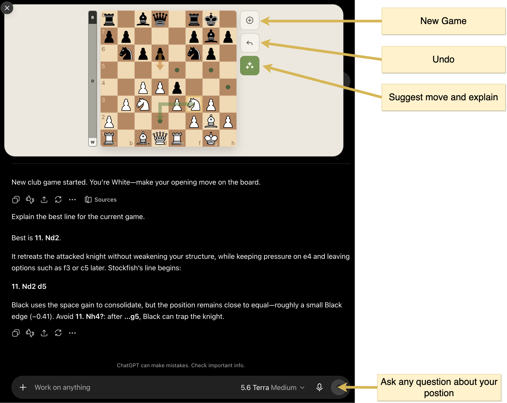

[](https://github.com/mdeclerk/StockfishGPT/actions/workflows/ci.yml)

# StockfishGPT

[](https://developers.openai.com/apps-sdk)
[](https://stockfishchess.org)
[](https://gofastmcp.com)
[](https://www.starlette.io)
[](https://react.dev)
[](https://vitejs.dev)
[](https://www.docker.com)

StockfishGPT is an [OpenAI Apps SDK](https://developers.openai.com/apps-sdk)-based App for playing White against Stockfish in ChatGPT, with an interactive React board and engine-grounded coaching.

<p align="center">
  
</p>

## Quick Start

1. **Install [Docker](https://docs.docker.com/get-docker/).**

2. **Start MCP App & Public HTTPS Tunnel.** Spin up MCP-App and cloudflared container:

   ```sh
   docker compose up
   ```

   Find public tunnel url `https://*.trycloudflare.com` in console output or search log explicitly:

   ```sh
   docker compose logs tunnel | grep trycloudflare
   ```

3. **Add MCP App in [ChatGPT](https://www.chatgpt.com).** Activate [Developer Mode](https://developers.openai.com/plugins/deploy/connect-chatgpt) (Settings → Security and login → Developer mode), then add a new plugin:
   - Name: `StockfishGPT`
   - URL: url from step 2 — don't forget to append `/mcp`!
   - No Auth

4. **Start App:**

   ```sh
   @StockfishGPT play
   ```

## Local Development

### Prerequisites

- [Python](https://www.python.org/downloads/) & [uv](https://docs.astral.sh/uv/getting-started/installation/)
- [Node.js](https://nodejs.org/en/download) & [npm](https://docs.npmjs.com/downloading-and-installing-node-js-and-npm)
- [Stockfish](https://stockfishchess.org/download/)

### Build & Run

Build and run MCP app with endpoint `http://localhost:8000/mcp`:

```sh
npm --prefix widget ci
npm --prefix widget run build
uv sync
uv run mcp-app --wdir widget/dist
```

### Tests

Frontend:

```sh
npm --prefix widget test
```

Backend:

```sh
uv run ruff check .
uv run pytest
```

### Frontend dev server

Test React widget using Vite dev server with endpoint `http://localhost:5173/`:

```sh
npm --prefix widget run dev
```

### MCP Inspector

Run app and start the inspector `npx @modelcontextprotocol/inspector@latest` with following settings:
- URL: `http://localhost:8000/mcp`
- Transport: `Streamable HTTP`
- Connection: `Via Proxy`

### ChatGPT

Full e2e experience on ChatGPT target:
- Run app via `uv run mcp-app --wdir widget/dist`
- Start public tunnel `docker compose up tunnel` using cloudflared
- Add app as ChatGPT Plugin as described in [Quick Start](#quick-start)

## Architecture

The server owns each game and returns complete authoritative snapshots. The widget is a display client: it submits actions, renders the returned FEN and history, and keeps only ephemeral presentation state. MCP HTTP transport stays stateless (`stateless_http=True`), while the long-lived chess service keeps games in memory for the server process lifetime.

> ⚠️ `ui/update-model-context` cannot currently be applied reliably due to [known upstream issue #221](https://github.com/openai/openai-apps-sdk-examples/issues/221).

<p align="center">
  
</p>


| MCP Tool | Arguments | Response | Visibility | R/W |
| --- | --- | --- | --- | --- |
| `start_game` | `difficulty` | `GameState` | model | W |
| `reset_game` | `game_id`, `version`, `difficulty` | `GameState` | app | W |
| `play_white_move` | `game_id`, `version`, `move_uci` | `GameState` | app | W |
| `undo_white_move` | `game_id`, `version` | `GameState` | app | W |
| `get_game_state` | `game_id` | `GameState` | model + app | R |
| `analyze_position` | `game_id` | `PositionAnalysis` | model + app | R |

## Project Structure

```text
.
├── .github/workflows/    # GitHub CI
├── src/mcp_app/
│   ├── mcp/              # FastMCP tools, resources, and wire schemas
│   ├── chess_service/    # Server-owned games, chess behavior, and domain models
│   ├── stockfish/        # Raw UCI process adapter
│   └── main.py           # CLI, composition, Starlette host, and lifespan
├── widget/               # React chess widget
├── tests/                # Backend test suite
├── Dockerfile            # Production container image
├── docker-compose.yml    # Container and tunnel setup
└── pyproject.toml        # Python project and tooling config
```

## License

GPL-3.0-or-later. See [`LICENSE`](LICENSE) and [`THIRD_PARTY_NOTICES.md`](THIRD_PARTY_NOTICES.md).
